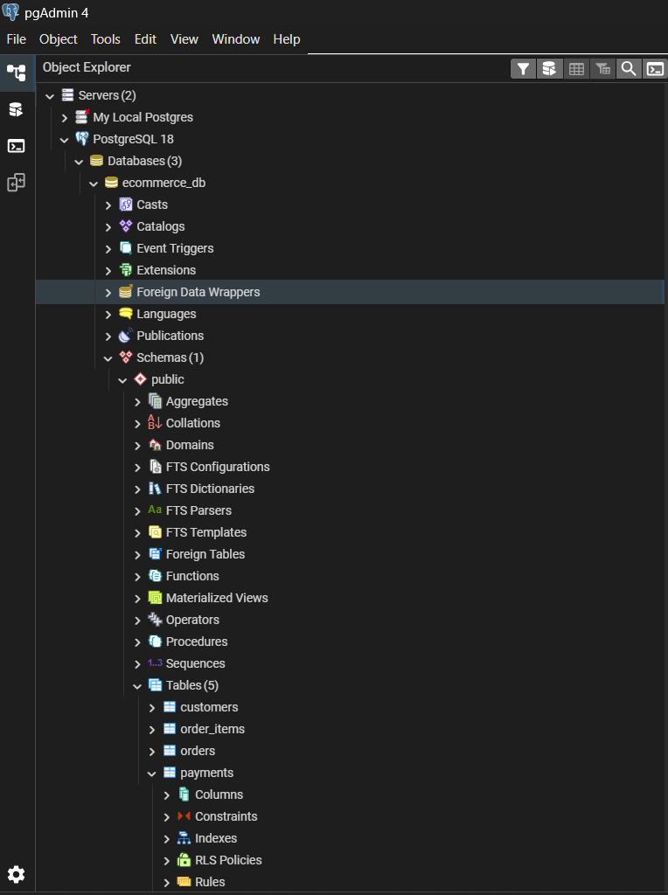
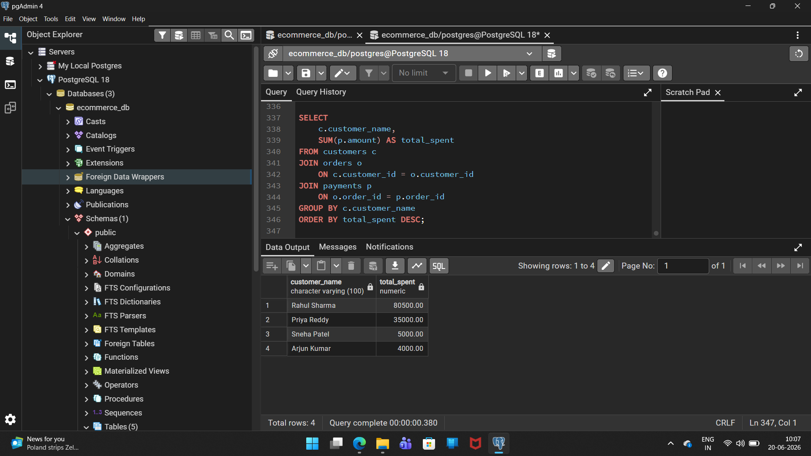
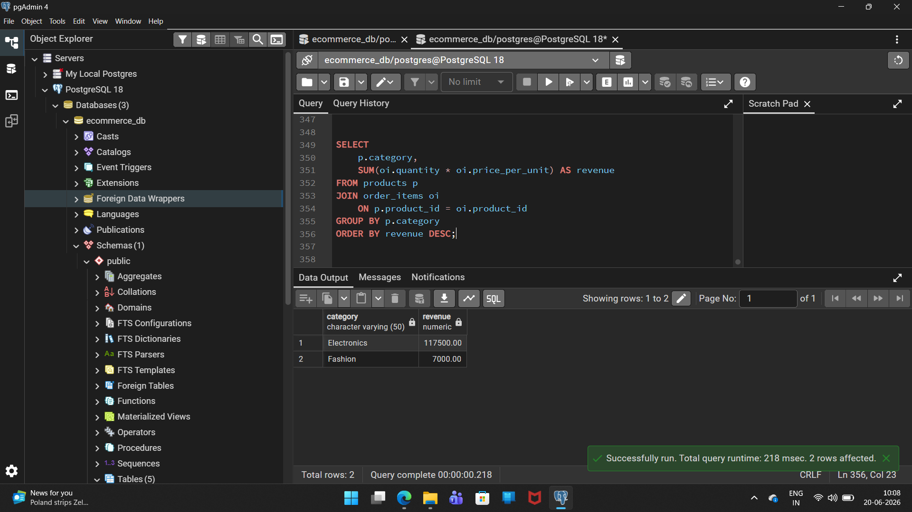
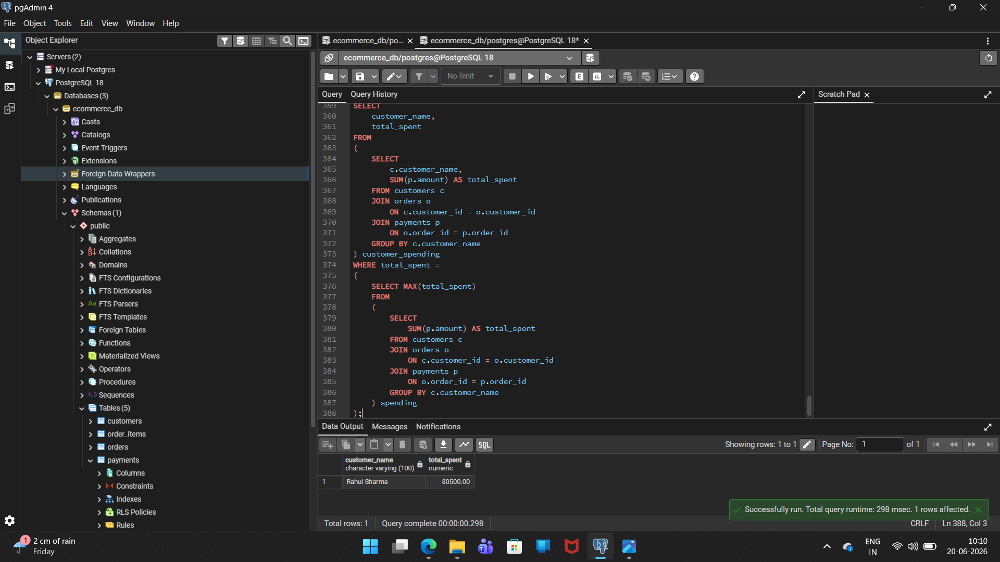
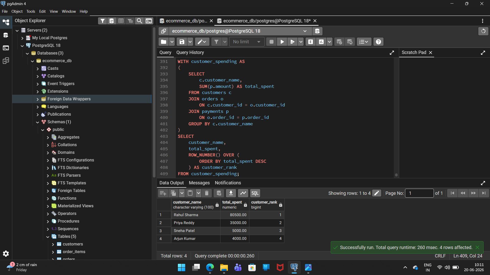
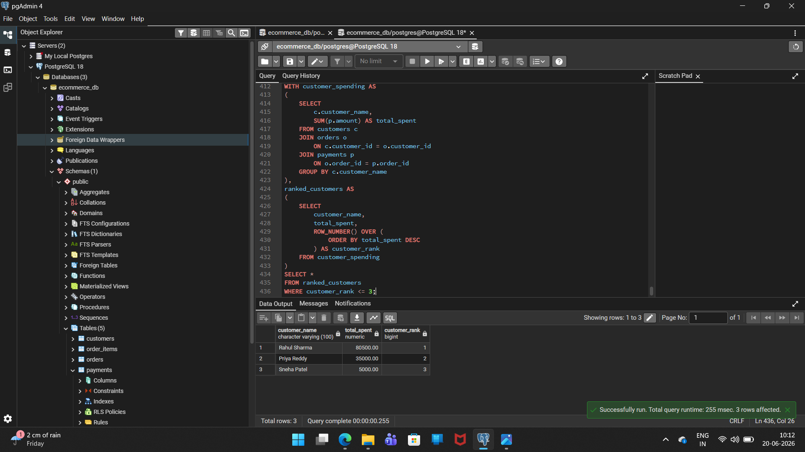

# 🛒 E-Commerce SQL Case Study

## 📌 Project Overview

This project demonstrates the use of SQL for designing, managing, and analyzing data in an E-Commerce environment. The database was built from scratch using PostgreSQL and includes customer, product, order, and payment data.

The objective of this project is to simulate real-world business scenarios and answer analytical questions related to customer behavior, sales performance, product demand, and revenue generation.

---

## 🎯 Project Objectives

- Design a relational database for an E-Commerce business.
- Implement primary and foreign key relationships.
- Populate the database with sample business data.
- Perform customer, revenue, product, and category analysis.
- Demonstrate SQL concepts frequently used by Data Analysts.
- Generate business insights using analytical SQL queries.

---

## 🗄️ Database Schema

The database consists of the following tables:

### Customers

| Column | Description |
|----------|-------------|
| customer_id | Unique customer identifier |
| customer_name | Customer name |
| email | Customer email |
| city | Customer location |
| signup_date | Customer registration date |

### Products

| Column | Description |
|----------|-------------|
| product_id | Unique product identifier |
| product_name | Product name |
| category | Product category |
| price | Product price |

### Orders

| Column | Description |
|----------|-------------|
| order_id | Unique order identifier |
| customer_id | Customer who placed the order |
| order_date | Date of order |
| order_status | Current order status |

### Order Items

| Column | Description |
|----------|-------------|
| order_item_id | Unique order item identifier |
| order_id | Associated order |
| product_id | Purchased product |
| quantity | Quantity purchased |
| price_per_unit | Product price at purchase time |

### Payments

| Column | Description |
|----------|-------------|
| payment_id | Unique payment identifier |
| order_id | Associated order |
| payment_method | Payment method used |
| amount | Payment amount |

---

## 🔗 Entity Relationship Diagram (ERD)

```text
customers
    │
    │ 1:M
    ▼
orders
    │
    │ 1:M
    ▼
order_items
    ▲
    │
    │ M:1
products

orders
    │
    │ 1:M
    ▼
payments
```

---

## 🧠 SQL Concepts Covered

### Database Design
- CREATE DATABASE
- CREATE TABLE
- Primary Keys
- Foreign Keys
- Data Types
- Normalization

### Data Manipulation
- INSERT INTO
- SELECT

### SQL Analysis
- INNER JOIN
- GROUP BY
- ORDER BY
- Aggregate Functions

### Aggregate Functions
- COUNT()
- SUM()
- AVG()
- MIN()
- MAX()

### Advanced SQL
- HAVING Clause
- Subqueries
- Common Table Expressions (CTEs)
- Window Functions

### Window Functions
- ROW_NUMBER()
- RANK()
- DENSE_RANK()

---

## 🚀 SQL Skills Demonstrated

- Relational Database Design
- Data Modeling
- Data Aggregation
- Multi-Table Joins
- Business Analysis Queries
- Customer Segmentation
- Revenue Analysis
- Product Performance Analysis
- Common Table Expressions (CTEs)
- Window Functions
- Analytical Problem Solving

---

## 📂 Project Structure

```text
Ecommerce_SQL_Case_Study/
│
├── schema.sql
├── data.sql
├── analysis.sql
├── 05_aggregate_functions.sql
├── 06_having_clause.sql
├── 07_subqueries.sql
├── 08_ctes.sql
├── 09_window_functions.sql
└── README.md
```

---

> **Note:** All screenshots were generated using PostgreSQL and pgAdmin during database creation, data population, and analytical query execution.

## 📸 Project Screenshots

### Database Schema



### Customer Spending Analysis



### Revenue by Category



### Highest Spending Customer



### Customer Ranking Using Window Functions



### Top 3 Customers



---

## 📊 Business Questions Answered

### Customer Analysis
- Show all customers and their orders.
- Identify the highest spending customer.
- Find customers spending above average.
- Rank customers by spending.
- Identify repeat customers.

### Revenue Analysis
- Calculate total revenue.
- Analyze revenue by payment method.
- Analyze revenue by category.
- Identify high-revenue categories.

### Product Analysis
- Identify best-selling products.
- Calculate revenue generated by each product.
- Rank products by revenue.
- Identify top-selling products.

### Category Analysis
- Determine category-wise revenue.
- Identify categories contributing significantly to revenue.

---

## 💡 Key Insights

Analysis of the sample dataset revealed the following business insights:

- Rahul Sharma emerged as the highest spending customer.
- Electronics was the top revenue-generating product category.
- Laptop contributed the highest individual product revenue.
- UPI was the most frequently used payment method.
- Repeat customers generated a significant portion of total revenue.
- Revenue was concentrated among a small number of high-value products.

---

## 🛠️ Tools Used

- PostgreSQL
- pgAdmin
- SQL

---

## 🎓 Learning Outcomes

Through this project, the following skills were developed:

- Relational Database Design
- Data Modeling
- SQL Query Writing
- Data Analysis using SQL
- Business Problem Solving
- Analytical Thinking
- Query Optimization Concepts
- Reporting and Documentation

---

## 🚀 Future Enhancements

Potential improvements for this project include:

- Larger and more realistic datasets
- Additional customer segmentation analysis
- Customer Lifetime Value (CLV) calculations
- Revenue contribution analysis
- Time-series sales analysis
- Dashboard integration using Power BI
- Data pipeline integration with Python

---

## 👨‍💻 Author

**V. Siva Satya Sai Krishna**

B.Tech – Computer Science and Engineering

Aspiring Data Analyst | SQL | PostgreSQL | Python | Power BI

---

⭐ If you found this project useful, feel free to fork, star, or use it for learning purposes.
